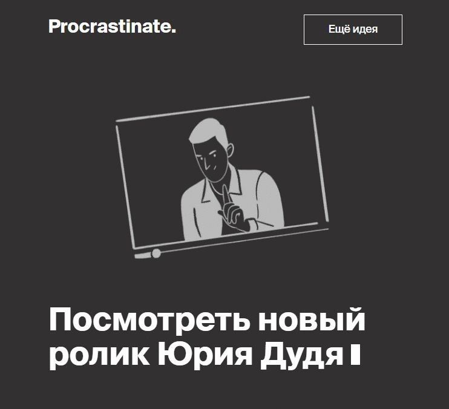

# Procrastinate
Уметь отдыхать не менее важно, чем уметь работать. Procrastinate. позволит расслабиться и сделать перерыв. Зайдите в него, нажмите на кнопку и получите совет о том, как отдохнуть.

Перейти на сайт **[Procrastinate](https://zen-haibt-cb97f6.netlify.app/)**.

<a target="_blank" href="https://recordit.co/7j7nQjfEAH"></a>

## Запуск на комьютере
Скопируйте и разархивируйте проект к себе на компьютер
Или выполните команду в [Git Bash](https://gitforwindows.org/) 
 ```
   	git clone https://github.com/AlexandrRogulin/Procrastinate.git
```